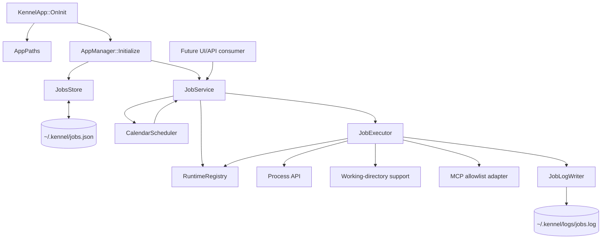
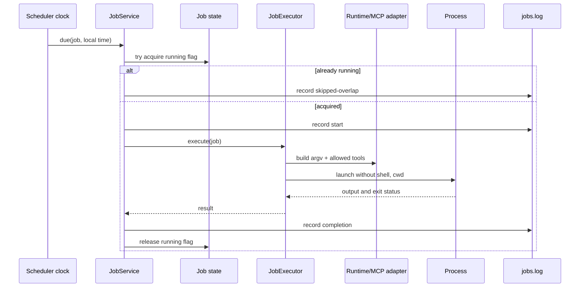

# Detailed Design: Timer-Based AI Prompt Jobs

## Overview

This feature adds infrastructure for recurring, calendar-based jobs in Kennel. A job launches a configured AI command with a prompt, structured runtime arguments, a per-job working directory, and an allowlist of MCP tools. Jobs persist in `~/.kennel/jobs.json`, execute only while Kennel is running, and write execution results to `~/.kennel/logs/jobs.log`.

Phase 1 deliberately excludes fixed-interval schedules, retries, notifications, automatic pausing, and a management UI. The infrastructure will expose a service/API that a future UI can use.

### Goals

- Provide durable job definitions and lifecycle operations.
- Schedule jobs daily or on selected weekdays at a local machine time.
- Support manual execution independent of schedule.
- Run predefined AI runtimes using safe, structured argv construction.
- Restrict MCP tools per job through an explicit allowlist.
- Prevent overlapping executions and record skipped occurrences.
- Keep scheduled execution off the UI thread.
- Preserve existing application logging while adding `jobs.log`.

### Non-goals for phase 1

- Fixed-interval schedules; deferred to phase 2.
- Catch-up execution for missed occurrences.
- Retry policies, failure notifications, or automatic pausing.
- Complete UI implementation.
- Arbitrary executable paths or free-form shell command templates.

## Detailed Requirements

### Job definition

Each job has:

- Stable identifier.
- User-facing name.
- Prompt text.
- Runtime selected from a predefined registry, such as `claude`, `codex`, or `kiro-cli`.
- Structured list of individual runtime arguments.
- Explicit MCP-tool allowlist.
- Optional working directory; defaults to the process working directory when absent.
- Enabled/disabled state.
- Calendar schedule consisting of daily or selected weekdays and one local time.

The prompt itself describes which files/directories to inspect and what actions to take. There is no separate phase-1 file list. MCP tool access is controlled by the configured allowlist.

### Lifecycle API

The infrastructure must support create, update, enable/disable, immediate run, delete, lookup, and listing operations. Persistence failures must be returned as `Status` errors and must not silently discard the in-memory state.

### Scheduling semantics

- Scheduling is active only while Kennel is running.
- Daily jobs run once per matching local calendar day at the configured time.
- Weekday jobs run once on each selected local weekday at the configured time.
- The current machine timezone is used; phase 1 does not persist a separate timezone.
- Missed occurrences are ignored when Kennel is stopped.
- If a job is running at its due time, that occurrence is skipped, not queued and not run concurrently.
- Manual runs participate in the same per-job non-overlap rule.
- Fixed intervals are out of scope.

### Execution

- The runtime executable is resolved from a predefined runtime registry, not supplied as an arbitrary path.
- Arguments are passed as individual argv entries.
- Kennel constructs the final argv from the registered executable, configured arguments, and prompt according to the runtime adapter.
- Shell interpretation is disabled.
- The configured working directory is passed to the process; absent value resolves to the process working directory.
- The executor supplies only the job's allowed MCP tools to the runtime integration.
- A zero exit code is a successful run; process-launch errors, nonzero exit codes, and integration errors are failures.
- No retries occur.

### Logging and observability

Every attempted execution is recorded in `~/.kennel/logs/jobs.log`, including:

- Job ID and name.
- Trigger type (`scheduled`, `manual`, or `skipped-overlap`).
- Start and completion timestamps.
- Runtime and working directory.
- Exit status or launch/integration error.
- Captured stdout/stderr or a bounded representation defined by implementation limits.
- Success/failure status.

Skipped occurrences are records too, so users can distinguish “not due” from “due but skipped.” Logging failure must not crash Kennel or change the execution result.

## Architecture Overview

`kennel_core` owns models, persistence, scheduling, execution, runtime registration, and job logging. `AppManager` owns the job store/service after startup. The future UI calls the service and observes returned state/results; it does not own scheduling.



### Runtime flow



## Components and Interfaces

### `JobDefinition`

A value type containing the persisted fields. Suggested fields:

- `wxString id`
- `wxString name`
- `wxString prompt`
- `wxString runtimeId`
- `std::vector<wxString> arguments`
- `std::vector<wxString> allowedMcpTools`
- `wxString workingDirectory`
- `bool enabled`
- `JobSchedule schedule`

### `JobSchedule`

Suggested representation:

- Schedule kind: `daily` or `weekdays`.
- `std::vector<int> weekdays` using a documented stable convention (for example, Monday = 1 through Sunday = 7).
- `hour` and `minute` in local time.

Validation rejects invalid times, empty weekday schedules, duplicate weekdays, and unsupported schedule kinds. Daily schedules ignore the weekday list.

### `JobsStore`

Responsibilities:

- Load `jobs.json`.
- Create a valid empty/default document if absent.
- Parse and validate job definitions.
- Save pretty-printed JSON atomically where practical.
- Expose raw-text operations only if required by the future UI; normal lifecycle operations should use typed models.

Suggested interface:

```cpp
class JobsStore {
public:
  explicit JobsStore(AppPaths paths);
  StatusOr<std::vector<JobDefinition>> Load();
  Status Save(const std::vector<JobDefinition>& jobs);
};
```

### `RuntimeRegistry`

Maps stable runtime IDs to trusted executable definitions and command-building behavior. It must expose the available runtime list to a future UI, reject unknown runtime IDs, and never accept arbitrary executable paths from JSON.

A runtime adapter builds argv from structured arguments and the prompt. It also describes how the allowed MCP-tool set is conveyed to that runtime integration. Runtime-specific behavior belongs here rather than in the scheduler.

### `JobExecutor`

Executes one job and returns a result. It validates the runtime, resolves the working directory, constructs argv, applies the MCP allowlist, invokes the direct process API, captures output, and maps exit/launch failures into a typed result.

Suggested interface:

```cpp
struct JobExecutionResult {
  bool success;
  int exitCode;
  wxString stdoutText;
  wxString stderrText;
  wxString error;
};

class JobExecutor {
public:
  JobExecutionResult Execute(const JobDefinition& job);
};
```

The process API should gain a safe `workingDirectory` parameter or an execution-options structure while retaining the non-shell default.

### `CalendarScheduler`

Owns the periodic wake-up mechanism and injectable clock. It determines due occurrences but delegates execution and overlap decisions to `JobService`. It must not execute AI commands on the UI thread.

The scheduler should use a modest polling cadence (for example, once per minute) and a persisted/in-memory last-trigger key to ensure one trigger per matching local date. A clock abstraction makes daylight-saving and boundary behavior testable.

### `JobService`

Coordinates store, scheduler, executor, concurrency state, and log writer. It is the primary future UI/API boundary.

Suggested operations:

```cpp
class JobService {
public:
  Status Load();
  StatusOr<JobDefinition> Create(JobDefinition job);
  Status Update(const JobDefinition& job);
  Status SetEnabled(const wxString& id, bool enabled);
  Status Delete(const wxString& id);
  Status RunNow(const wxString& id);
  std::vector<JobDefinition> List() const;
  Status Start();
  void Stop();
};
```

`RunNow` returns after scheduling/dispatching work or uses a future/result abstraction; the exact asynchronous result contract should be chosen to match the future UI API. It must report a skipped result when the job is already running.

### `JobLogWriter`

Writes only job records to `jobs.log`, independently of the singleton application logger. It should serialize concurrent writes, append and flush each record, and tolerate logging failures. A line-oriented structured format such as JSON Lines is recommended because each execution is a distinct record and future UI tooling can parse it.

## Data Models

### `jobs.json` document

Suggested top-level format:

```json
{
  "version": 1,
  "jobs": [
    {
      "id": "job-uuid",
      "name": "Check Kennel GitHub issues",
      "prompt": "Check the source files in /home/eran/devl/codelite and see if anything was changed.",
      "runtime": "claude",
      "arguments": ["--model", "Haiku"],
      "allowedMcpTools": ["github.read_issue", "slack.send_message"],
      "workingDirectory": "/home/eran/devl/kennel",
      "enabled": true,
      "schedule": {
        "kind": "weekdays",
        "weekdays": [7],
        "hour": 16,
        "minute": 0
      }
    }
  ]
}
```

The exact field names are part of the implementation contract and should be kept stable once published. Missing optional `workingDirectory` means the process working directory. The schema should include a version for future migration.

### Job log record

Recommended JSON Lines record shape:

```json
{
  "jobId": "job-uuid",
  "jobName": "Check Kennel GitHub issues",
  "trigger": "scheduled",
  "status": "success",
  "startedAt": "2026-01-30T16:00:00.123Z",
  "finishedAt": "2026-01-30T16:00:08.456Z",
  "runtime": "claude",
  "workingDirectory": "/home/eran/devl/kennel",
  "exitCode": 0,
  "stdout": "...",
  "stderr": ""
}
```

Secrets must not be written deliberately. Argument redaction rules should be applied if runtime arguments may contain credentials.

## Error Handling

- Missing `jobs.json`: initialize an empty job collection and persist it.
- Malformed JSON: return a `Status` error, log the problem through the application logger, and retain the last valid in-memory collection where available.
- Invalid job fields: reject the individual create/update operation with a descriptive validation error; do not persist partial changes.
- Unknown runtime: reject load/create/update or mark the document invalid according to the store policy; phase 1 should prefer explicit errors over arbitrary execution.
- Invalid working directory: fail the execution and record the failure; do not crash the scheduler.
- Process launch failure/nonzero exit: record failure with diagnostics; do not retry.
- MCP setup/allowlist failure: record failure and do not expose tools outside the allowlist.
- Overlap: record `skipped-overlap` and leave the existing execution untouched.
- Jobs-log write failure: report through the normal logger if possible, but preserve the execution result and keep the scheduler alive.
- Shutdown: stop new dispatches, allow running work to complete or cancel according to the process abstraction, and avoid use-after-free in completion callbacks.

## Testing Strategy

Tests belong in `kennel_core` and should avoid requiring the GUI.

1. **Model validation and serialization**
   - Round-trip valid daily and weekday jobs.
   - Reject invalid time, weekday, schedule kind, missing required fields, and unknown runtime.
   - Apply the process-working-directory default when working directory is absent.
2. **JobsStore**
   - Create/load/save `jobs.json` under an injected temporary home.
   - Recover correctly from absent files.
   - Refuse malformed JSON without replacing valid in-memory state.
3. **Calendar scheduler**
   - Trigger daily jobs once on the matching local date/time.
   - Trigger selected weekdays only on selected days.
   - Ignore missed occurrences after a stopped period.
   - Verify local-time boundary behavior with an injected clock.
4. **Execution**
   - Verify predefined runtime resolution and structured argv construction.
   - Verify prompt and arguments remain separate argv values and no shell is used.
   - Verify working-directory propagation.
   - Map zero exit, nonzero exit, and launch errors.
5. **Concurrency**
   - Confirm a second scheduled/manual invocation is skipped while the first is active.
   - Confirm completion releases the running state.
6. **Job logging**
   - Verify start/completion/failure/skipped records and concurrent append behavior.
   - Verify application logger remains configured for `kennel.log`.
7. **Service lifecycle**
   - Exercise create/update/enable/delete/run-now and persistence integration.
   - Confirm disabled jobs do not schedule.

## Appendices

### A. Technology Choices

- **C++20 and existing wxBase**: consistent with the project and keeps core code aligned with existing build targets.
- **`nlohmann::json`**: already used by Kennel stores, reducing dependencies and preserving conventions.
- **Direct argv process execution**: avoids shell injection and matches structured argument requirements.
- **Dedicated JSON Lines job log**: separates job records from application diagnostics and supports incremental parsing.
- **Injectable clock**: makes calendar behavior deterministic and avoids brittle wall-clock tests.
- **Worker execution with synchronized service state**: prevents AI commands from blocking the UI while enforcing no overlap.

### B. Existing Solutions Analysis

Kennel already has reusable foundations: `AppPaths`, `JsonUtil`, `Status`/`StatusOr`, `AppManager`, `Process`, `Logger`, and a `wxTimer` usage pattern. No existing job scheduler or MCP-specific implementation was identified in the inspected source. The feature should extend these foundations rather than create a parallel configuration or process system.

### C. Alternative Approaches

1. **Put jobs in `config.json`**: rejected because requirements specify `jobs.json` and jobs have an independent lifecycle.
2. **Use cron/OS task scheduling**: rejected because scheduling must be available only while Kennel is running and missed occurrences are ignored.
3. **Use shell command strings**: rejected for security and portability; structured argv is required.
4. **Run commands on the UI thread**: rejected because AI work can be long-running and would freeze the application.
5. **Reuse the singleton logger by switching its file**: rejected because it would redirect normal application logs and is unsafe with concurrent execution.
6. **Implement fixed intervals now**: deferred to phase 2 as explicitly requested.

### D. Research Findings and Constraints

- Application paths are rooted at `~/.kennel`; adding `jobs.json` is straightforward.
- Existing stores are tolerant for missing fields but reject malformed JSON via `Status`/`StatusOr`.
- `Process` supports vector argv and non-shell execution but needs working-directory support.
- Existing `Logger` supports one file target, requiring a dedicated job writer.
- `kennel_core` is the correct location for testable infrastructure.
- MCP integration details were not present in the inspected source; the runtime/MCP adapter boundary must isolate that uncertainty and be validated during implementation.

### E. Phase 2 Candidates

- Fixed-interval scheduling and its anchoring semantics.
- Retry and backoff policies.
- Repeated-failure notifications.
- Automatic pause behavior.
- Rich run-history APIs and UI.
- More advanced timezone and daylight-saving policies.
