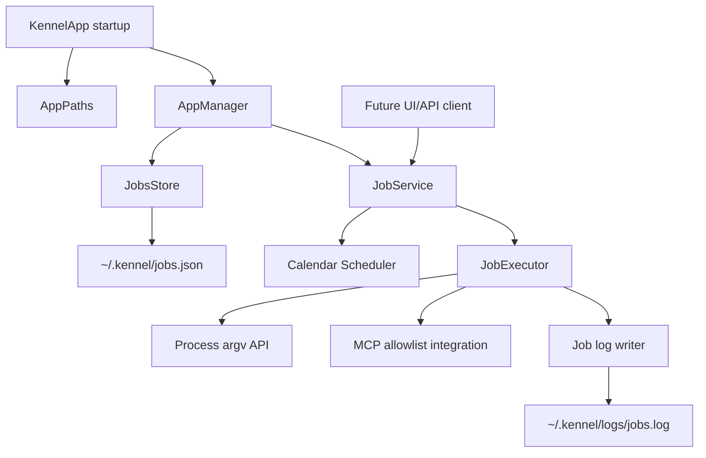

# Existing Kennel Code Research

## Scope

Repository inspection only, as requested. No external resources were used.

## Findings

### Application initialization

`src/app/KennelApp.cpp` initializes `AppPaths`, creates `~/.kennel` directories, configures the process-wide `Logger`, installs the crash handler, and calls `AppManager::Initialize(paths)` before creating the main frame.

This makes `AppManager::Initialize` the natural integration point for loading and starting a job service after persistence and logging are available.

### Application paths

`src/core/AppPaths.h` and `src/core/AppPaths.cpp` centralize paths rooted at `~/.kennel`. Existing JSON files include `config.json`, `workspace.json`, `hosts.json`, and `.persist.json`; logs are stored under `~/.kennel/logs`.

A jobs feature should add a `JobsFile()` path returning `~/.kennel/jobs.json`. `EnsureDirectories()` already creates the root and logs directories, so no new directory is needed.

### Persistence conventions

`ConfigStore` uses `nlohmann::json` through `JsonUtil`, UTF-8 file helpers, tolerant typed readers, `Status`/`StatusOr`, and pretty-printed JSON. `AppManager` owns process-wide stores and loaded state.

A dedicated `JobsStore` should follow this pattern rather than extending `config.json`, because the requirements specify a separate `jobs.json` file and the feature has its own lifecycle.

### Logging

`Logger` is a process-wide singleton with severity filtering and an append-mode file target. It writes timestamped lines and flushes after every message. Startup currently configures `~/.kennel/logs/kennel.log` once.

The requirement for a separate `jobs.log` is compatible with the existing logger API, but the current logger has one active file target. The implementation must either add a named/supplemental logger or introduce a scoped/job-log writer; changing `SetLogFile` per execution would redirect application logging and is not safe. Job records should include at least job identity, trigger type, start/end or duration, command/runtime, exit status, and captured output/error according to the final design.

### Process execution

`src/core/Process.hpp` and `src/core/Process.cpp` provide direct argv-based synchronous and asynchronous process execution. The non-shell overload accepts `std::vector<std::string>` and avoids shell interpretation, which matches the structured-argument and predefined-runtime requirements.

`Process::RunProcessAndWait(argv, use_shell=false)` captures stdout and stderr and returns a `ProcessOutput` with `ok`, `out`, and `err`. This is a strong foundation for a job executor. Working-directory support is not present in the inspected public API, so the process layer will need an extension or a platform-neutral execution wrapper.

### Timer precedent

`ActivityMonitor` uses `wxTimer` and `wxEvtHandler`; timer callbacks run on the UI thread. This is a useful precedent but is session/UI-oriented. A scheduler should avoid blocking the UI thread while running an AI command. A timer callback can identify due jobs and dispatch execution to a worker thread, with completion state synchronized back to the service.

### Build structure

`kennel_core` is explicitly UI-agnostic and testable. New job models, persistence, scheduling, execution, and logging infrastructure should be added to `kennel_core`; a future UI can consume the service through `AppManager` or a dedicated API.

## Proposed component relationship

## Open implementation questions for design

1. How the existing MCP infrastructure exposes tools to child AI runtimes was not found through the initial repository searches and needs focused inspection.
2. The process API needs a safe working-directory mechanism.
3. The logger needs a separate jobs-log strategy without disturbing `kennel.log`.
4. The scheduler needs a testable clock and calendar-matching abstraction rather than relying directly on wall-clock time in tests.

## Sources

- [KennelApp.cpp](../../../src/app/KennelApp.cpp)
- [AppPaths.h](../../../src/core/AppPaths.h)
- [AppPaths.cpp](../../../src/core/AppPaths.cpp)
- [ConfigStore.h](../../../src/core/ConfigStore.h)
- [ConfigStore.cpp](../../../src/core/ConfigStore.cpp)
- [AppManager.h](../../../src/core/AppManager.h)
- [AppManager.cpp](../../../src/core/AppManager.cpp)
- [Logger.h](../../../src/core/Logger.h)
- [Logger.cpp](../../../src/core/Logger.cpp)
- [Process.hpp](../../../src/core/Process.hpp)
- [ActivityMonitor.h](../../../src/core/ActivityMonitor.h)
- [ActivityMonitor.cpp](../../../src/core/ActivityMonitor.cpp)
- [CMakeLists.txt](../../../CMakeLists.txt)
