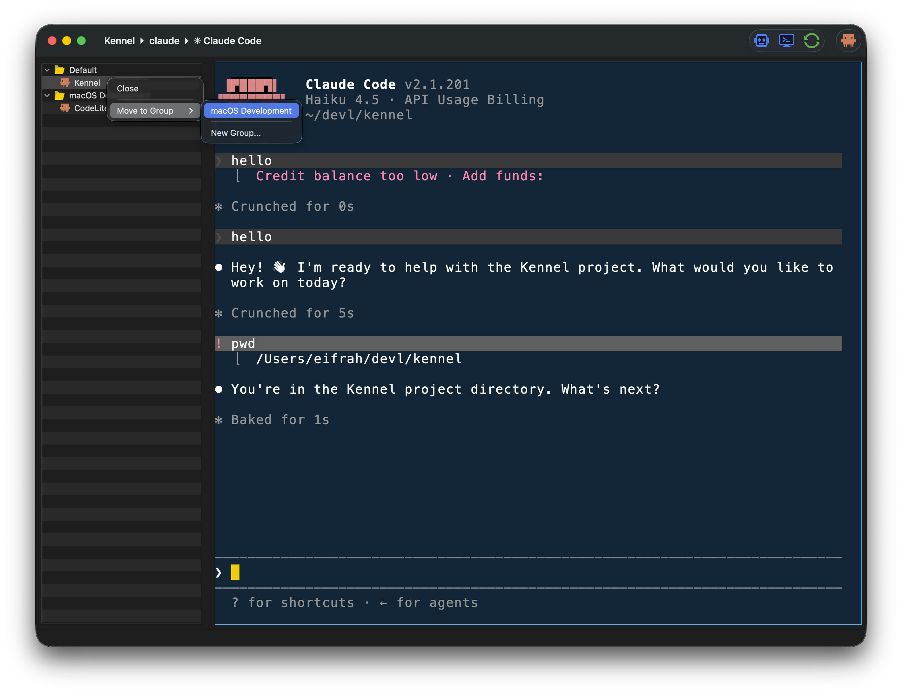
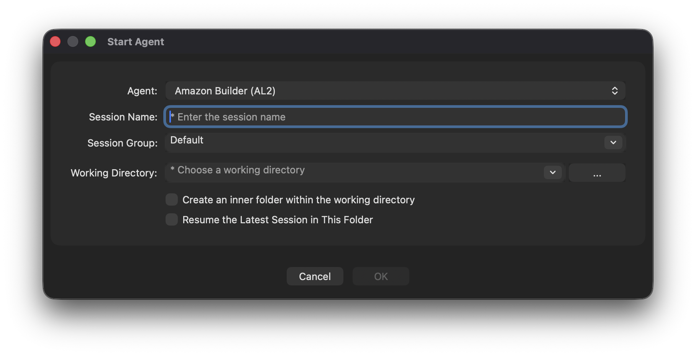
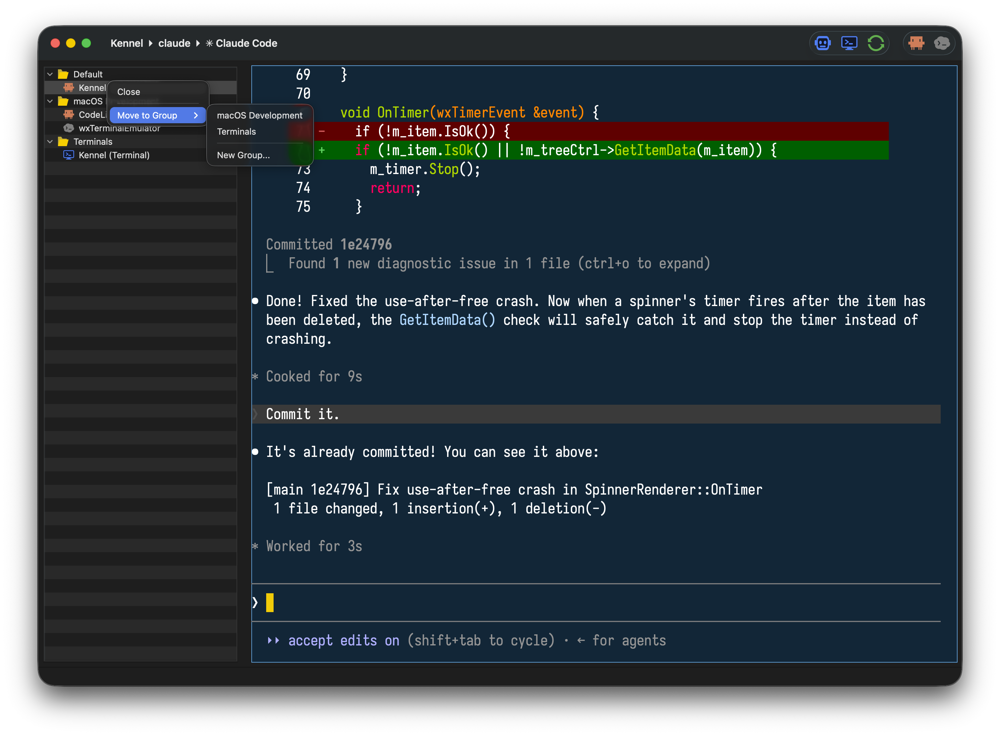
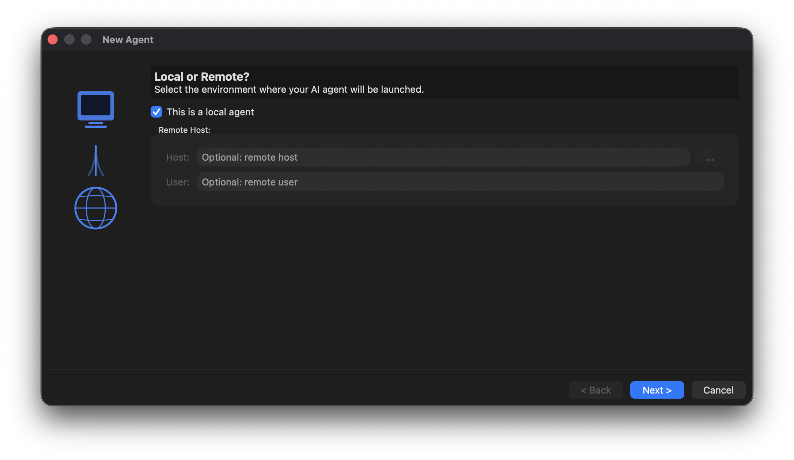
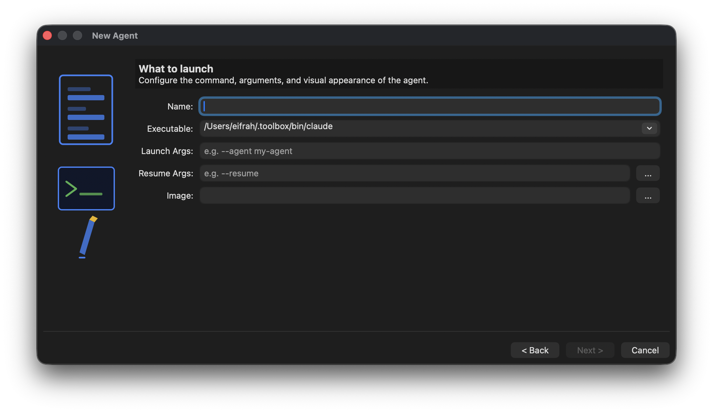
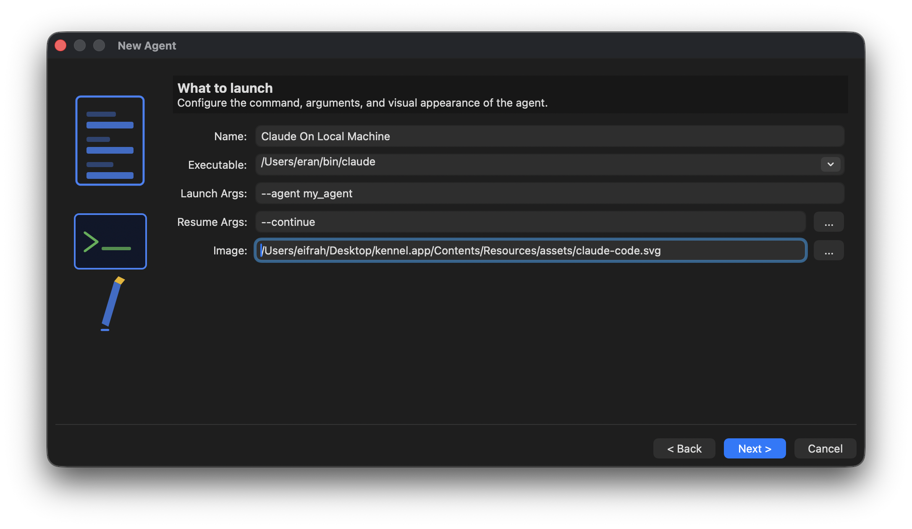
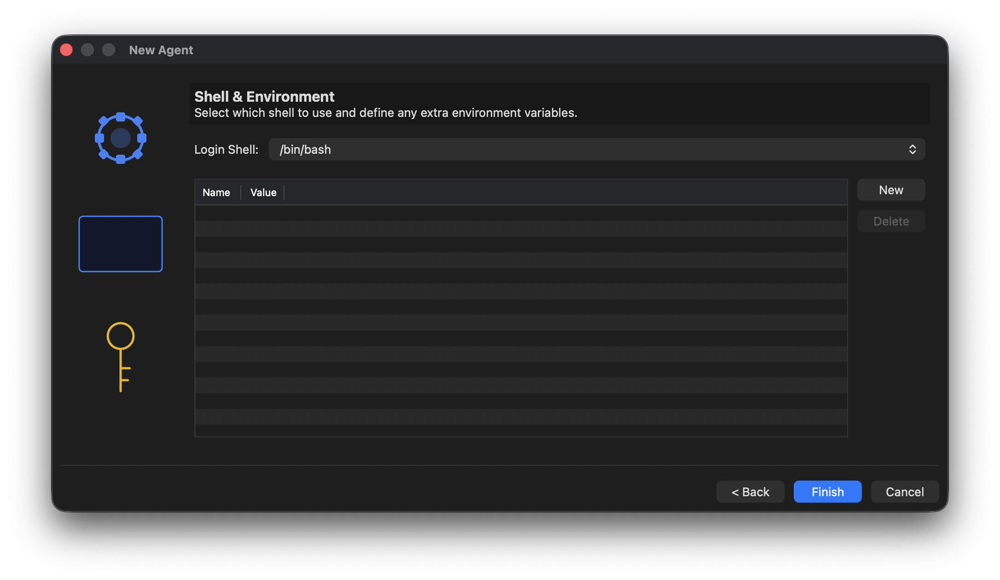
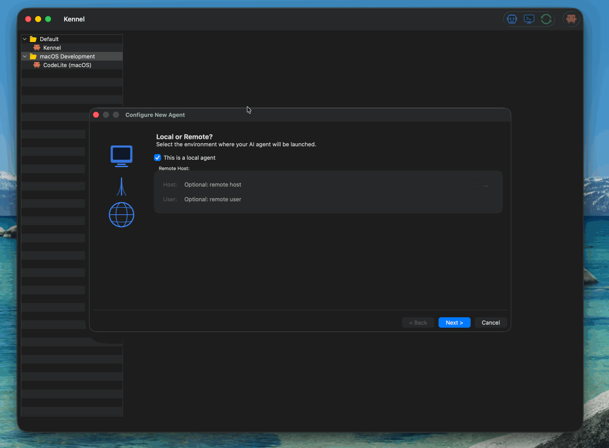

<div align="center">

# 🐾 Kennel

**Where AI Agents Live Between Tasks**

</div>

Kennel is a fast, native desktop app that lets you run and manage many interactive
AI CLI agents — like **Claude Code**, **Kiro CLI**, **OpenAI Codex**, or any tool of
your own — side by side in a single window. Organize them into groups, keep them
running between tasks, and jump between conversations without juggling terminal tabs.
**Most importantly: restart your app or reboot your machine, and every session comes
back exactly where it left off, using the agent's native resume flag** (e.g., Claude's
`--continue` or Kiro's `--resume`).




## Download

| Platform | Download | Notes |
|---|---|---|
| **Windows 11** | [kennel-1.3.0-amd64-installer.exe](https://github.com/eranif/kennel/releases/download/1.3.0/kennel-1.3.0-amd64-installer.exe) | Installer for Windows 11 and later |
| **macOS ARM** | [kennel-macOS_26.5.2_arm64.zip](https://github.com/eranif/kennel/releases/download/1.3.0/kennel-macOS_26.5.2_arm64.zip) | Signed + notarized app bundle for Apple Silicon |

See [Releases](https://github.com/eranif/kennel/releases) for other platforms and versions.

---

## Why Kennel?

If you use AI coding agents from the terminal, you already know the pain: a dozen
terminal tabs, no idea which agent is waiting for you, and lost context every time
you close a window. Kennel fixes that.

- 🗂️ **Everything in one place** — every agent session lives in a single window, in a
  tidy sidebar you can organize however you like.
- 📁 **Group your work** — bucket sessions into groups such as *Work*, *Customer
  Tickets*, or *Experiments*. Collapse a group to get it out of the way; reopen it
  when you're back.
- 🔄 **Never lose your place** — sessions persist between app restarts and resume with
  their native `--resume`/`--continue` flags, so your agent picks up where it left off.
- ⚡ **Runs everything, natively** — each session is a real terminal (full PTY) backed by
  OpenGL on macOS & Windows, so any interactive CLI works exactly as it does in your shell
  — colors, prompts, and all.
- 🧩 **Add any agent, no code required** — define new agents through a simple dialog or
  JSON. Local or over SSH.
- 🌈 **Make it yours** — built-in color themes, custom fonts, and per-agent icons.

---

## What's New in 1.3.0

Version 1.3.0 reworks session navigation around a single tree and adds a full
scheduled-jobs system:

- **Single Session Tree** — the left pane is now one Groups → Sessions tree with a
  single detail pane, replacing the old per-group tabs
- **Scheduled Jobs** — run a shell command or agent prompt on a fixed hourly interval,
  managed from **Jobs → Manage Jobs...**; jobs can be enabled/disabled and run on demand
- **Job Run History** — every job run is logged to `~/.kennel/logs/jobs.log`, browsable
  and filterable from **Jobs → View Job Log...**
- **Duplicate Session** — clone a session's agent, group, and working directory into a
  new one via the right-click menu
- **Multiple Instances** — the new `-d <dir>` flag lets you run several Kennel instances
  side by side, each with its own data directory
- **Global Session Cycling** — Alt+Arrow now cycles through *all* open sessions instead
  of navigating groups first
- Numerous stability fixes, including a Windows crash when collapsing tree groups and
  crash-prone group deletion on macOS

See [Release Notes](RELEASE_NOTES_1.3.0.md) for the complete changelog (previous:
[1.2.0](RELEASE_NOTES_1.2.0.md)).

---

## Screenshots

| Start an agent | Manage groups |
|---|---|
|  |  |

### New Agent Wizard

Define a new agent in three guided steps:

| Step 1 — Local or Remote? | Step 2 — What to launch |
|---|---|
|  |  |

| Step 2 — Filled in | Step 3 — Shell & Environment |
|---|---|
|  |  |

### Configuring a New Agent in Action



---

## Core Concepts

Kennel has just three things to understand:

| Concept | What it is |
|---|---|
| **Agent** | A definition of *how to launch* an AI CLI — its executable, arguments, environment, icon, and (optionally) a remote host. Kennel ships with **Claude Code**, **Kiro CLI**, and **OpenAI Codex** predefined. |
| **Session** | A single, named, running instance of an agent in a working directory. Each session is a live terminal. |
| **Group** | A folder in the sidebar that holds related sessions. There's always a **Default** group; create as many others as you want. |

The sidebar on the left is a tree of **Groups → Sessions**. The large area on the
right is the terminal for the currently selected session.

---

## Getting Started

### 1. Start an agent

Press **`Ctrl`/`Cmd`+`T`**, choose **File → Start Agent…**, or click the **➕** button
in the toolbar. The **Start Agent** dialog lets you set:

- **Agent** — which CLI to launch (defaults to your configured default agent).
- **Session Name** — a unique, human-friendly label for this session.
- **Session Group** — pick an existing group or type a new name to create one on the fly.
- **Working Directory** — where the agent runs. Browse locally, or browse a **remote
  host over SSH** for remote agents.
  - *Create an inner folder within the working directory* — automatically nests a folder
    named after the session.
  - *Resume the Latest Session in This Folder* — relaunch the most recent agent run from
    that directory instead of starting fresh.

Click **OK** and your agent launches in a new session under the chosen group.

### 2. Work with your session

Selecting a session in the sidebar brings its terminal to the front. Type and interact
exactly as you would in any terminal. While an agent is busy, its sidebar icon shows a
spinner; when it's done, it returns to the agent's icon — so you can tell at a glance
which agents are working and which are waiting for you. If a background session finishes
while the window is inactive, Kennel gently requests your attention.

### 3. Organize with groups

Right-click a session for the context menu:

- **Rename…** (or **Rename Terminal** for plain terminals) — rename just this session.
- **Duplicate…** — open **Start Agent** pre-filled with this session's agent, group, and
  a generated unique name, for spinning up a clone.
- **Move to Group ▸** — send the session to another group, or **New Group…** to create
  one. Moving the last session out of a group removes the empty group (except **Default**,
  which always stays).
- **Close** — permanently remove the session.

Right-click a **group** header for:

- **Start Agent…** — launch a new agent pre-assigned to that group.
- **Rename Group…** — rename the group (Default can't be renamed).
- **Close Group** — close every session in the group at once.
- **Refresh** — restart every session in the group.

Clicking a group header in the tree only expands or collapses it — the detail pane on
the right always shows the currently selected session, not the group.

---

## Scheduled Jobs

Beyond interactive sessions, Kennel can run things on a timer, whether or not you're
watching:

- A **job** either runs a raw shell command, or sends a one-shot prompt to a configured
  agent running in non-interactive mode. Each job fires on a fixed interval (in hours).
- **Jobs → Manage Jobs…** opens a CRUD dialog: **New…**, **Edit…**, **Delete**, and
  **Run Now**. Each job can also be individually enabled or disabled — a disabled job is
  skipped, but its next-run time keeps advancing so it won't fire a backlog of missed
  runs once re-enabled.
- Jobs launch into a dedicated **Jobs** session group. These are one-shot runs and
  aren't persisted to the workspace the way regular sessions are.
- **Run Now** saves any pending edits and focuses the new session's terminal; jobs fired
  automatically by the scheduler run quietly in the background without stealing focus.
- **Jobs → View Job Log…** shows every job run (start/end/failed) recorded in
  `~/.kennel/logs/jobs.log`, newest first, with a live filter box. Double-click (or press
  Enter on) a row to see the full record as pretty-printed JSON in a read-only viewer.

---

## Managing Agents

Beyond the three built-ins, you can define your own agents — a locally-installed CLI,
an internal tool, or an agent that runs on a **remote machine over SSH**.

Open **File → Create New Agent…** (**`Ctrl`/`Cmd`+`N`**) to launch the **New Agent
Wizard**, which walks you through three steps:

### Step 1 — Local or Remote?

Choose whether the agent runs on your local machine or on a remote host over SSH.
If remote, provide the host address and (optionally) a username. You can browse your
saved SSH hosts with the **…** button.

### Step 2 — What to launch

Configure the agent's identity and command:

| Field | Purpose |
|---|---|
| **Name** | Display name shown in menus and the sidebar. |
| **Executable** | The command to run — the wizard auto-discovers known CLIs (`claude`, `kiro-cli`, `codex`) locally or on the remote host. |
| **Launch Args** | Arguments passed on every launch (e.g. `--agent my-agent`). |
| **Resume Args** | Flag(s) used to resume a prior session (e.g. `--resume`, `--continue`). Pick from suggestions via **…**. |
| **Image** | An SVG icon to represent the agent in the UI. Browse shipped assets via **…**. |

### Step 3 — Shell & Environment

| Field | Purpose |
|---|---|
| **Login Shell** | Override the shell used to spawn the agent (e.g. `/bin/zsh`, `wsl.exe`). |
| **Environment Variables** | Extra name/value pairs passed to the agent process. Add or remove with the **New** / **Delete** buttons. |

Click **Finish** and the new agent appears immediately in the toolbar and the
**Start Agent** dialog.

---

## Keyboard Shortcuts

| Action | Shortcut |
|---|---|
| Start Agent | `Ctrl`/`Cmd` + `T` |
| New Terminal | `Ctrl`/`Cmd` + `E` |
| Create New Agent | `Ctrl`/`Cmd` + `N` |
| Restart Current Session | `F5` |
| Rename Session | `F2` |
| Select Next Session (any group) | `Alt` + `→` |
| Select Previous Session (any group) | `Alt` + `←` |

Session cycling moves through every open session in order, regardless of which group
it belongs to.

---

## Session Persistence & Restore

Kennel remembers your sessions between runs. On restart it restores each session and,
where the agent supports it, resumes the underlying conversation using that agent's
native resume flag (configured as **Resume Args**). This means closing Kennel — or
rebooting — doesn't cost you your agent's context.

Sessions that self-exit (via `Ctrl-D` or `exit`) are automatically removed from the
sidebar.

---

## Customization

- **Themes** — pick from an extensive collection of terminal color themes in **Settings → Theme** with real-time preview (includes Cobalt2, Monokai, One Dark, One Light, Solarized, and more). Changes apply instantly without restart.
- **Font** — set the terminal font and size from **Settings → Change Terminal Font…** with live preview.
- **Terminal Preferences** — customize scrollback buffer size and choose to close tabs with a middle-click.
- **Session Icons** — each session group is automatically assigned a unique persistent colored icon for easy visual identification.
- **Remote hosts** — manage reusable SSH hosts from **Settings → Manage Remote Hosts…**.
- **Update Checks** — enable or disable automatic startup update checks from **Settings → Update Checks**.
- **Plain terminals** — open a terminal without an agent via **File → New Terminal** (`Ctrl`/`Cmd`+`E`).

All settings live under `~/.kennel/` and are editable in the app. Your preferences persist across session restarts.

---

## Installation

For build prerequisites, per-platform instructions, and the developer guide, see
**[BUILDING.md](BUILDING.md)**.

---

## Where Kennel Stores Things

Everything lives under `~/.kennel/`:

```
~/.kennel/
├── config.json      # Your agent definitions and job definitions
├── workspace.json   # Your sessions and their groups
├── .persist.json    # UI preferences (window size, theme, fonts) — safe to delete
└── logs/
    ├── kennel.log   # Application log
    └── jobs.log     # Job run history (JSON Lines: one JSON object per line)
```

Corrupt `config.json` or `workspace.json` files self-recover: Kennel backs up the bad
file (`*.bak-<timestamp>`) and falls back to safe defaults, so the app always launches.

Pass `-d <dir>` on the command line to store all of the above under `<dir>/.kennel`
instead of `~/.kennel` — useful for running multiple Kennel instances side by side with
independent data.

### Advanced: editing agents as JSON

Agents are stored in `config.json` under the `agents` array. The **Edit / New Agent**
dialog is the friendly front-end for this, but you can edit the file directly:

```json
{
  "version": 1,
  "global": {},
  "agents": [
    {
      "name": "Claude Code",
      "executable": "claude",
      "baseArgs": [],
      "resumeArg": "--continue",
      "iconPath": "claude-code.svg",
      "extraArgs": [],
      "env": {}
    },
    {
      "name": "Kiro CLI",
      "executable": "kiro-cli",
      "baseArgs": ["chat"],
      "resumeArg": "--resume",
      "iconPath": "kiro.svg",
      "extraArgs": [],
      "env": {}
    },
    {
      "name": "Remote Builder",
      "executable": "kiro-cli",
      "baseArgs": ["chat"],
      "resumeArg": "--resume",
      "iconPath": "builder.svg",
      "extraArgs": [],
      "remoteHost": "dev-box.example.com",
      "remoteUser": "user",
      "env": { 
        "PATH": "/home/user/python3/bin:$PATH" 
      }
    }
  ]
}
```

Set `remoteHost`/`remoteUser` to run an agent over SSH.

---

## Troubleshooting

**A session won't launch.** Make sure the agent's **Executable** is on your `PATH`
(or use an absolute path). Check `~/.kennel/logs/kennel.log` for the exact command and
error.

**Remote (SSH) agent fails to connect.** Confirm you can `ssh <user>@<host>`
non-interactively (key-based auth). Kennel uploads a small helper and runs the agent
over an interactive SSH session.

**Sessions didn't come back after restart.** Verify `~/.kennel/workspace.json` exists
and is readable; if it was corrupt, look for a `workspace.json.bak-<timestamp>` backup.

**Theme colors look off.** Pick a built-in theme from **Settings → Theme** and check the
log for theme-loading errors.

---

## License

Kennel is licensed under the **BSD 3-Clause License**. See [`LICENSE`](LICENSE).

## Author

**Eran Ifrah** — [GitHub](https://github.com/eranif)

## Related Projects

- [CodeLite IDE](https://codelite.org) — the cross-platform, OpenSource IDE.
- [wxTerminalEmulator](https://github.com/eranif/wxTerminalEmulator) — the embedded
  terminal control that powers Kennel's sessions (fetched automatically at build time).
- [wxWidgets](https://www.wxwidgets.org) — the cross-platform GUI toolkit Kennel is built on.
